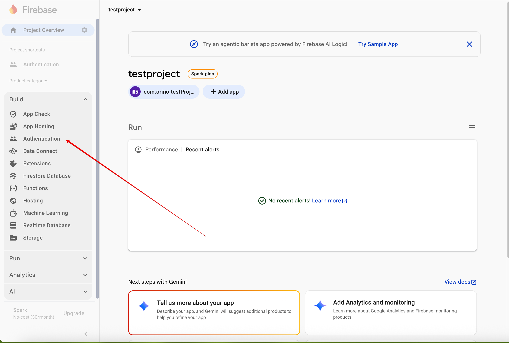
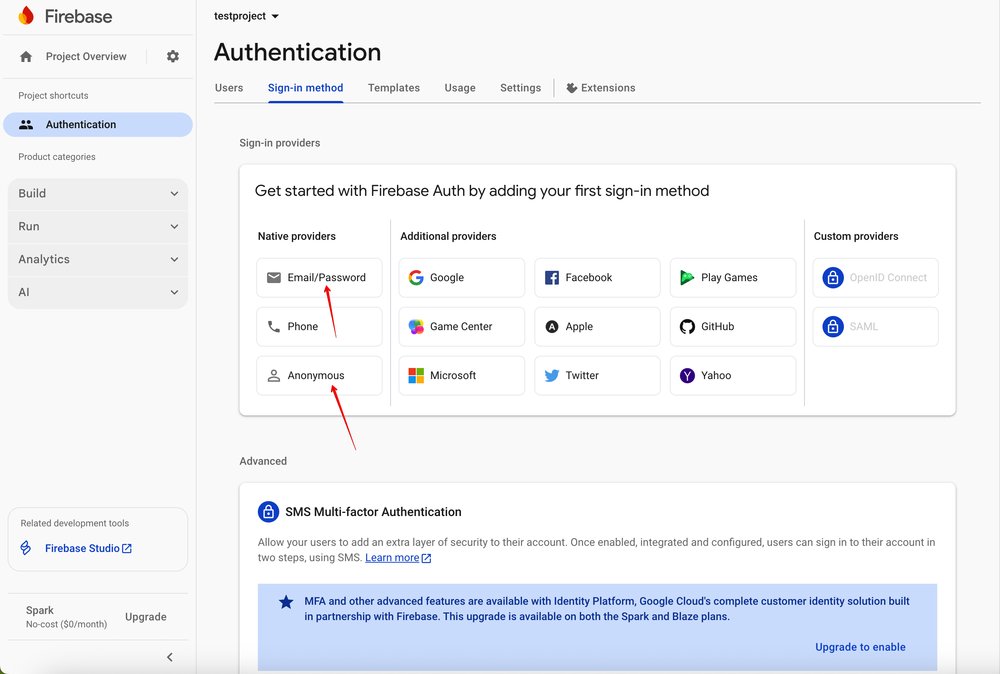

## Clone
```bash
git clone https://github.com/Orino1/flight-tracker-test-ios.git
```
## Setup up firebase + APN from Apple developer account

1. explained from **kenmaro's prototyping** on https://www.youtube.com/watch?v=-6kb_Sq2lrQ ( just skip swiftui code part )
2. after that we need to enable email and anonymous signing from -> firebase console → Project -> Build -> Authentication -> enable ** Email/Password** and **Anonymous**   

## Before runing on real device
1. in Helpers.swift there is a const baseURL maybe it shall be changed into the mac public ip rather than localhost and also fastapi shall be exposed to local newtrork lol

## Run on real device

1. connect real device into the mac ( using same apple accoun on both just in case ;)
2. from top bar of xcode select your device ( will be shown with its name )
3. run it
